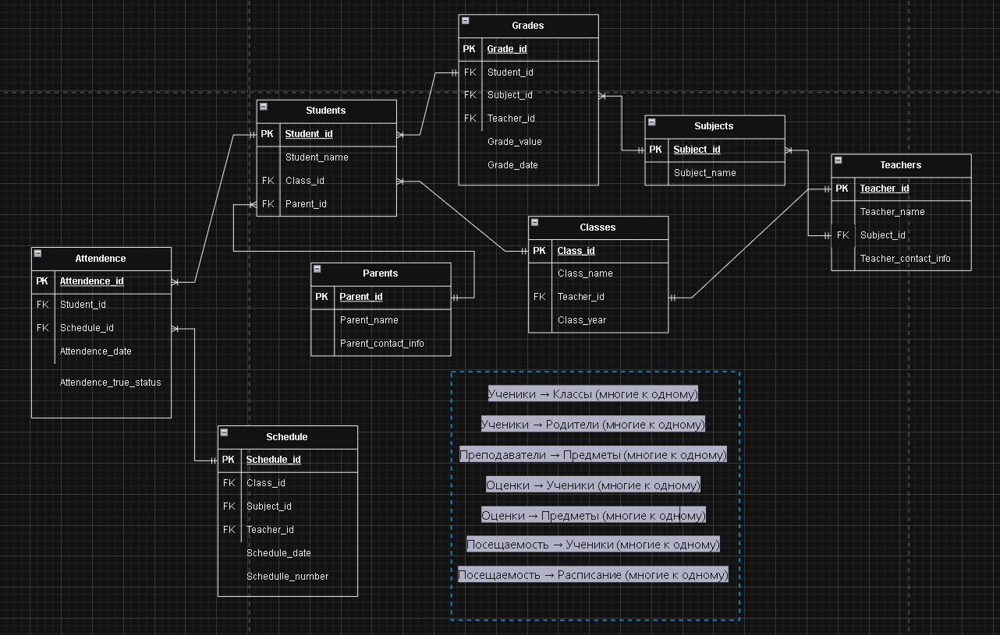

Задача 1
Нужно смоделировать БД для реализации электронного журнала старшей школы.
Использоваться будет для учета посещаемости и операционных задач, например:
• отправлять сообщения родителям, ученики которых прогуляли больше 3 занятий на
неделе;
• выплачивать премии классным руководителям, у которых в классе самая хорошая
успеваемость
Нарисуй, пожалуйста, какие нужны таблицы, атрибуты в них, связи между ними - то есть
схему БД ( или ER-диаграмму).

